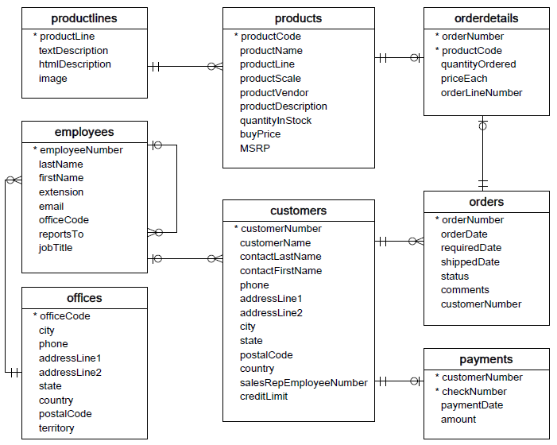

# 这个是msql的示例数据库
https://www.begtut.com/mysql/mysql-sample-database.html
# 各个表之间的关系

现在出现了这个问题
# org.apache.ibatis.binding.BindingException: Invalid bound statement (not found): com.xiaohu.dao.CustomersDaoMapper.findAll